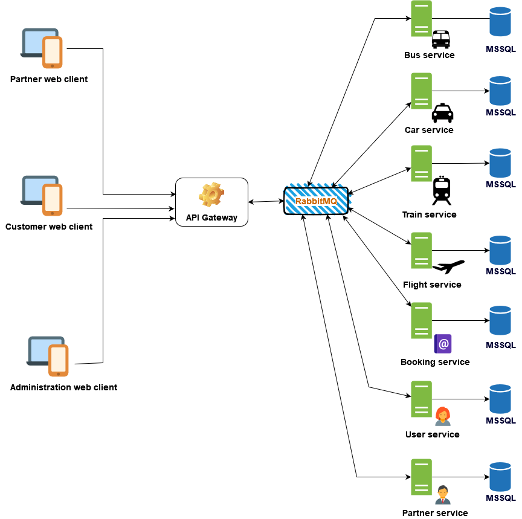

# Airport Transfer 🚃🚗✈️🚄

A vehicles and flights booking application applying micro-service architecture.

## Architecture

## Prerequisites

  1. [Docker Desktop](https://www.docker.com/products/docker-desktop)

## Optionals

  1. Linux environment (Windows users can use [WSL2](https://docs.microsoft.com/en-us/windows/wsl/about))
  2. Shell terminal

## Instructions

  1. Open your terminal
  2. Navigate to this repository. For example: `cd airport-transfer`.
  3. Set environment variables:
     1. `export EMAIL_USERNAME=your-email`
     2. `export EMAIL_PASSWORD=your-email-password`
  4. Run `docker compose up -d` and wait until everything is running.
  5. Open your browser and navigate to following address:
      1. [localhost:3000](http://localhost:3000) if you want to manage your vehicles, policies and schedules.
      2. [localhost:3001](http://localhost:3001) for browsing and booking vehicles
      3. [localhost:3002](http://localhost:3002) is designed for administration works.
